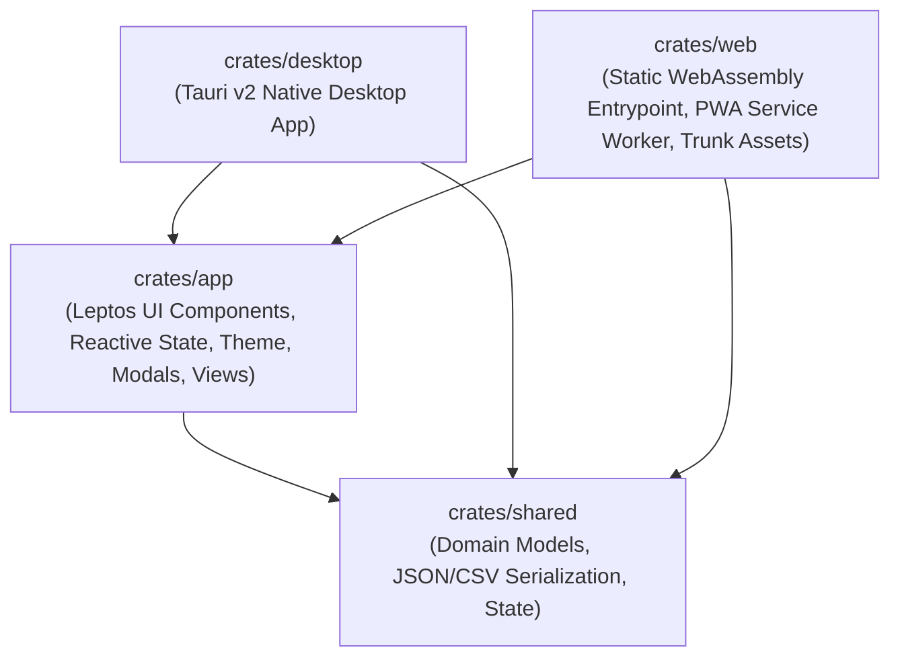

# Serverless & Desktop Leptos Template

A production-ready, modular Rust & [Leptos 0.8](https://leptos.dev) template designed for high-performance **Serverless Web (WASM / Cloudflare Pages / PWA via Trunk)** and **Native Desktop (Tauri v2)** applications.

Based directly on the proven architecture, production fixes, and deployment pipelines of [Revisited IPIP-NEO](https://github.com/Spodeian/Revisited-IPIP-NEO).

---

## 🏛️ Architectural Structure

The workspace is organized into four decoupled crates:



- **[`crates/shared`](crates/shared)**: Core domain models, business logic, configuration (`ThemeMode`, `AppConfig`, `AppState`), and interchange serialization (JSON and CSV import/export).
- **[`crates/app`](crates/app)**: Leptos UI components, reactive signals, responsive layout, dark/light theme engine, modal dialogs, and persistent state management via `LocalStorage`.
- **[`crates/web`](crates/web)**: WebAssembly client entrypoint with `wasm-bindgen`, Trunk bundling configuration, and PWA / serverless assets (`index.html`, `style.css`, `sw.js`, `manifest.json`, `_headers`, `_redirects`).
- **[`crates/desktop`](crates/desktop)**: Native desktop runner configured with `tauri` v2, custom protocol asset serving, and native window management.

---

## ✨ Key Features

- **⚡ Serverless Static Web & Native Desktop Dual-Target**: Compile identical reactive application logic to static client-side WASM bundles for Cloudflare Pages or native desktop executables via Tauri v2.
- **💾 Automatic Cross-Platform State Persistence**: Synchronizes local state seamlessly across browser refreshes and desktop restarts using browser `LocalStorage`.
- **📱 Responsive & Touch-Friendly UI**: Layout automatically adapts across desktop displays, tablets, and mobile viewports with an adaptive navbar and drawer.
- **🎨 Theme Engine**: Built-in Dark Mode and a soothing, high-contrast Warm Light Mode with instant DOM synchronization and persistence.
- **⌨️ Intuitive Keyboard Support**: Press `Enter` to quickly submit new items and `Escape` to close open modal dialogs.
- **📦 Data Interchange & File Downloads**: Built-in JSON & CSV export/import dialogs with copy-to-clipboard toasts and direct browser file download triggers (`trigger_file_download`).
- **📶 Immutable Serverless PWA Caching**: Hybrid service worker caching strategy (**Network-First** for `index.html` to ensure atomic releases; **Cache-First** for immutable, content-hashed `.wasm`, `.js`, and `.css` assets) with offline fallback.
- **🛡️ SRI Minification Immunity**: Configured with `data-integrity="none"` to allow aggressive post-build asset minification (HTML, CSS, JS) without SRI hash mismatches or white screens.
- **🚀 Cloudflare Pages Build System v3 & GitHub Pages CI/CD**: Fully compliant with Cloudflare's modern v3 build image, automated toolchain installation (`rust-toolchain.toml`), SPA routing (`_redirects`), Cloudflare headers (`_headers`), Wrangler configuration (`wrangler.toml`), and GitHub Actions workflow (`.github/workflows/ci.yml`).

---

## 🛠️ Build Requirements

- **Rust**: Automatically managed via [`rust-toolchain.toml`](rust-toolchain.toml) (installs stable with `wasm32-unknown-unknown`).
- **Trunk Bundler**:
  ```bash
  cargo install trunk
  ```
- *(Optional)* **wasm-opt** (Binaryen v122+) for release size optimization.
- *(Optional)* **Tauri CLI**:
  ```bash
  cargo install tauri-cli
  ```

---

## 🚀 Development Quickstart

### 1. Run Web App Locally (Trunk)
```bash
trunk serve
```
Open [http://localhost:8080](http://localhost:8080) in your browser. Live reloading is automatically enabled.

### 2. Run Native Desktop App (Tauri)
```bash
cargo tauri dev
```
Launches the native desktop window with live webview reloading.

### 3. Run Test Suite
```bash
cargo test --workspace
```

### 4. Run Clippy Static Analysis
```bash
cargo clippy --workspace --all-targets
```

---

## 📦 Production Builds & Deployment

### Static Serverless WASM Bundle (Trunk)
```bash
trunk build --release
```
The optimized output assets (`index.html`, `.wasm`, `.js`, `.css`, `_headers`, `_redirects`, `sw.js`) will be located in `crates/web/dist/`.

### Cloudflare Pages (Build System v3)

Deploy directly to Cloudflare Pages using the automated build script:

```bash
bash deploy.sh
```

#### Cloudflare Pages Dashboard Settings:
- **Build System Version**: `v3` (2024/2026 build image)
- **Framework Preset**: `None` (or `Custom`)
- **Build Command**: `bash deploy.sh`
- **Build Output Directory**: `crates/web/dist`
- **Environment Variables**:
  - `RUST_VERSION`: `stable` (Optional if `rust-toolchain.toml` is present)
  - `CARGO_HOME`: `/opt/buildhome/.cargo`

#### Local Testing with Wrangler:
```bash
trunk build --release
npx wrangler pages dev crates/web/dist
```

### Native Desktop Executable (Tauri v2)
```bash
cargo tauri build
```
The compiled release executable and installer bundles will be generated in `target/release/bundle/`.

---

## 🧩 Customizing for Your App

1. **Rename Workspace & Metadata**: Update `name`, `version`, `authors`, and `description` in [`Cargo.toml`](Cargo.toml) and subcrate manifests.
2. **Define Domain Data**: Replace `Item` and `ItemCollection` in [`crates/shared/src/models.rs`](crates/shared/src/models.rs) with your application's domain models.
3. **Build Views & Components**: Update [`crates/app/src/lib.rs`](crates/app/src/lib.rs) and [`crates/app/src/components/`](crates/app/src/components/) with your UI widgets, layouts, and views.
4. **Update PWA & SEO Tags**: Customize `title`, meta description, OpenGraph tags, and icons in [`crates/web/index.html`](crates/web/index.html) and [`crates/web/manifest.json`](crates/web/manifest.json).

---

## 📄 License

This template is dual-licensed under [MIT](LICENSE) or Apache 2.0 at your option.
