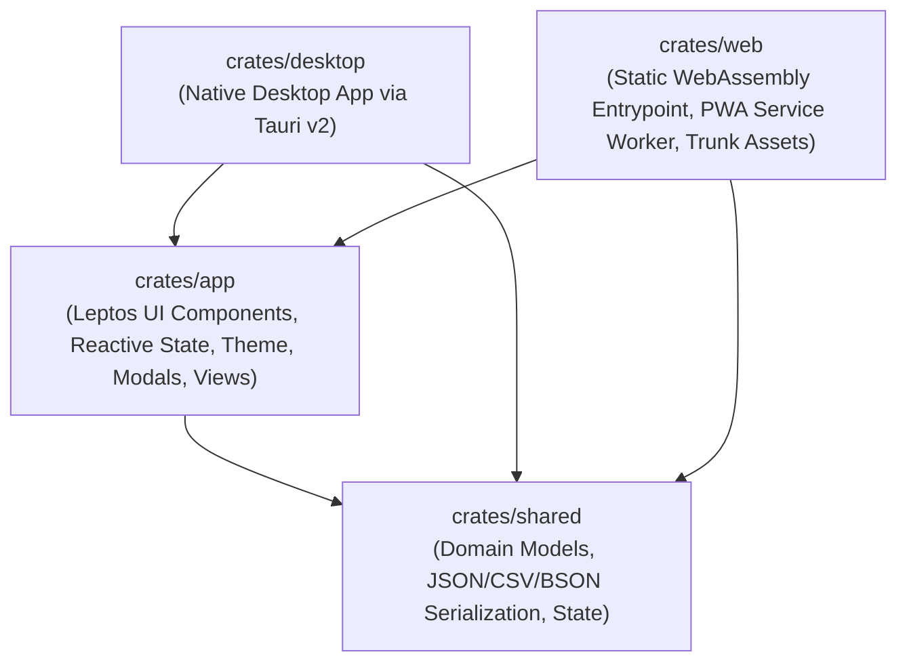

# Serverless & Desktop Leptos Template

[](https://github.com/Spodeian/efficient-leptos-template/actions/workflows/ci.yml)
[](https://github.com/Spodeian/efficient-leptos-template/actions/workflows/static.yml)
[](LICENSE)
[](https://www.rust-lang.org)
[](https://leptos.dev)
[](https://v2.tauri.app)
[](https://pages.cloudflare.com)

A production-ready, modular Rust & [Leptos 0.8](https://leptos.dev) template designed for high-performance **Serverless Web (WASM / Cloudflare Pages / PWA via Trunk)** and **Native Desktop (Windows, macOS, Linux via Tauri v2)** applications.

Based directly on the proven architecture, production fixes, and deployment pipelines of [Revisited IPIP-NEO](https://github.com/Spodeian/Revisited-IPIP-NEO).

---

## 🏛️ Architectural Structure

The workspace is organized into four decoupled, single-responsibility crates:



- **[`crates/shared`](crates/shared)**: Core domain models, business logic, configuration (`ThemeMode`, `AppConfig`, `AppState`), and interchange serialization (JSON, CSV, and compressed BSON import/export).
- **[`crates/app`](crates/app)**: Modular Leptos UI components, reactive signals, responsive layout, dark/light theme engine, modal dialogs, and persistent multi-tier state management (`components/navbar.rs`, `components/item_list.rs`, `components/modals.rs`, `components/theme.rs`).
- **[`crates/desktop`](crates/desktop)**: Native desktop runner configured with Tauri v2, custom protocol asset serving, bundled application icons, and native window management.
- **[`crates/web`](crates/web)**: WebAssembly client entrypoint with `wasm-bindgen`, Trunk bundling configuration, and PWA / serverless assets (`index.html`, `style.css`, `sw.js`, `manifest.json`, `favicon.svg`, `favicon.ico`, `_headers`, `_redirects`).

---

## ✨ Key Features

- **⚡ Serverless Static Web & Native Desktop Dual-Target**: Compile identical reactive application logic to static client-side WASM bundles for Cloudflare Pages and GitHub Pages or native desktop executables via Tauri v2.
- **💾 Automatic Cross-Platform State Persistence**:
  - **Tier 1 (Fast Sync)**: Synchronous browser `LocalStorage` under dedicated key `serverless_leptos_app_state`.
  - **Tier 2 (Extended Quota)**: Asynchronous `IndexedDB` fallback if `LocalStorage` quota is exceeded.
  - **Storage Diagnostics Bridge**: Real-time inspection of storage persistence status (`persisted` vs `ephemeral`) and permission requests (`StorageManager.persist()`).
- **📱 Responsive & Touch-Friendly UI**: Layout automatically adapts across widescreen monitors, tablets, and mobile devices with a responsive navbar, search filters, and progress metrics.
- **🎨 Theme Engine**: Built-in Charcoal Dark Mode and soothing Warm Light Mode with instant DOM attribute synchronization (`data-theme`) and persistence.
- **⌨️ Intuitive Keyboard Support**: Press `Enter` to quickly submit new items and `Escape` to close open modal dialogs.
- **📦 Data Interchange & File Downloads**:
  - Built-in export and import dialogs supporting formatted **JSON**, RFC 4180-compliant **CSV**, and compact **Compressed BSON** (Zlib-compressed binary).
  - Copy-to-clipboard notification feedback and direct browser file download triggers (`trigger_file_download`, `trigger_binary_download`).
- **📶 Immutable Serverless PWA Caching**: Hybrid service worker caching strategy (**Network-First** for `index.html` to ensure atomic releases; **Cache-First** for immutable, content-hashed `.wasm`, `.js`, and `.css` assets) with offline fallback.
- **🛡️ SRI Minification Immunity**: Configured with `data-integrity="none"` in `index.html` to allow aggressive post-build asset minification (HTML, CSS, JS) without SRI hash mismatches or white screens.
- **🚀 Automated CI/CD & Deployment Pipelines**: Fully compliant with Cloudflare Pages Build System v3 (`deploy.sh`), GitHub Pages (`.github/workflows/static.yml`), and GitHub Actions CI test suite (`.github/workflows/ci.yml`).

---

## 🛠️ Build Requirements

- **Rust Toolchain**: Automatically managed via [`rust-toolchain.toml`](rust-toolchain.toml) (installs stable with `wasm32-unknown-unknown`).
- **Trunk Bundler**:
  ```bash
  cargo install trunk
  ```
- **Node.js 24 LTS**: (Required for asset minification pipelines, Wrangler edge previews, and Cloudflare Pages compatibility; managed via [`.node-version`](.node-version) / [`.nvmrc`](.nvmrc)):
  ```bash
  nvm use # or fnm use
  ```
- *(Optional)* **wasm-opt** (Binaryen v122+) for release size optimization.
- *(Optional)* **Tauri CLI** (for native desktop development):
  ```bash
  cargo install tauri-cli
  ```

---

## 🚀 Development Quickstart

### 1. Run Web App Locally (Trunk)
```bash
trunk serve
```
Open [http://localhost:8080](http://localhost:8080) in your browser. Live reloading is automatically enabled.

### 2. Run Native Desktop App (Tauri)
```bash
cargo tauri dev
```
Launches the native desktop window with live webview reloading.

### 3. Run Test Suite
```bash
# Standard cargo test
cargo test --workspace

# Or with cargo-nextest (faster, parallel execution)
cargo nextest run --workspace
```

### 4. Run Static Analysis & Linter
```bash
cargo clippy --workspace --all-targets -- -D warnings
```

---

## 📦 Production Builds & Deployment

### Static Serverless WASM Bundle (Trunk)
```bash
trunk build --release
```
The optimized output assets (`index.html`, `.wasm`, `.js`, `.css`, `_headers`, `_redirects`, `sw.js`) will be located in `crates/web/dist/`.

### Cloudflare Pages (Build System v3)

Deploy directly to Cloudflare Pages using the automated build script:

```bash
bash deploy.sh
```

#### Cloudflare Pages Dashboard Settings:
- **Build System Version**: `v3` (2024/2026 build image)
- **Framework Preset**: `None` (or `Custom`)
- **Build Command**: `bash deploy.sh`
- **Build Output Directory**: `crates/web/dist`
- **Environment Variables**:
  - `NODE_VERSION`: `24`
  - `RUST_VERSION`: `stable` (Optional if `rust-toolchain.toml` is present)
  - `CARGO_HOME`: `/opt/buildhome/.cargo`

#### Local Preview with Wrangler:
```bash
trunk build --release
npx wrangler pages dev crates/web/dist
```

### GitHub Pages Deployment

The repository includes an automated GitHub Actions workflow in [`.github/workflows/static.yml`](.github/workflows/static.yml) that builds, minifies, and deploys your WASM web application to GitHub Pages whenever you push changes to `main`.

### Native Desktop Executable (Tauri v2)
```bash
cargo tauri build
```
The compiled release executable and installer bundles will be generated in `target/release/bundle/`.

---

## 🧩 Customizing for Your App

1. **Rename Workspace & Metadata**: Update `name`, `version`, `authors`, and `repository` in [`Cargo.toml`](Cargo.toml) and subcrate manifests.
2. **Define Domain Data**: Replace `Item` and `ItemCollection` in [`crates/shared/src/models.rs`](crates/shared/src/models.rs) with your application's domain models.
3. **Build Views & Components**: Update or add reactive Leptos components in [`crates/app/src/components/`](crates/app/src/components/):
   - [`components/navbar.rs`](crates/app/src/components/navbar.rs): Header navigation and tools.
   - [`components/item_list.rs`](crates/app/src/components/item_list.rs): Reactive item listing and input forms.
   - [`components/modals.rs`](crates/app/src/components/modals.rs): Modal dialogs and data import/export.
   - [`components/theme.rs`](crates/app/src/components/theme.rs): Theme manager and toggle button.
4. **Update PWA & SEO Tags**: Customize `title`, meta description, OpenGraph tags, and icons in [`crates/web/index.html`](crates/web/index.html), [`crates/web/manifest.json`](crates/web/manifest.json), and [`crates/desktop/tauri.conf.json`](crates/desktop/tauri.conf.json).

---

## 🧪 Testing & Quality Assurance

| Test Suite | Location | Purpose |
|---|---|---|
| **Shared Model Tests** | `crates/shared/tests/shared_tests.rs` | Collection logic, JSON/CSV/BSON roundtrip, backward compatibility |
| **Desktop Smoke** | `crates/desktop/tests/smoke_tests.rs` | Tauri context generation and configuration validation |
| **Web Smoke** | `crates/web/tests/smoke_tests.rs` | WebAssembly client initialization and App state linkage |

---

## 📄 License

This template is dual-licensed under [MIT](LICENSE-MIT) or [Apache 2.0](LICENSE-APACHE) at your option.
